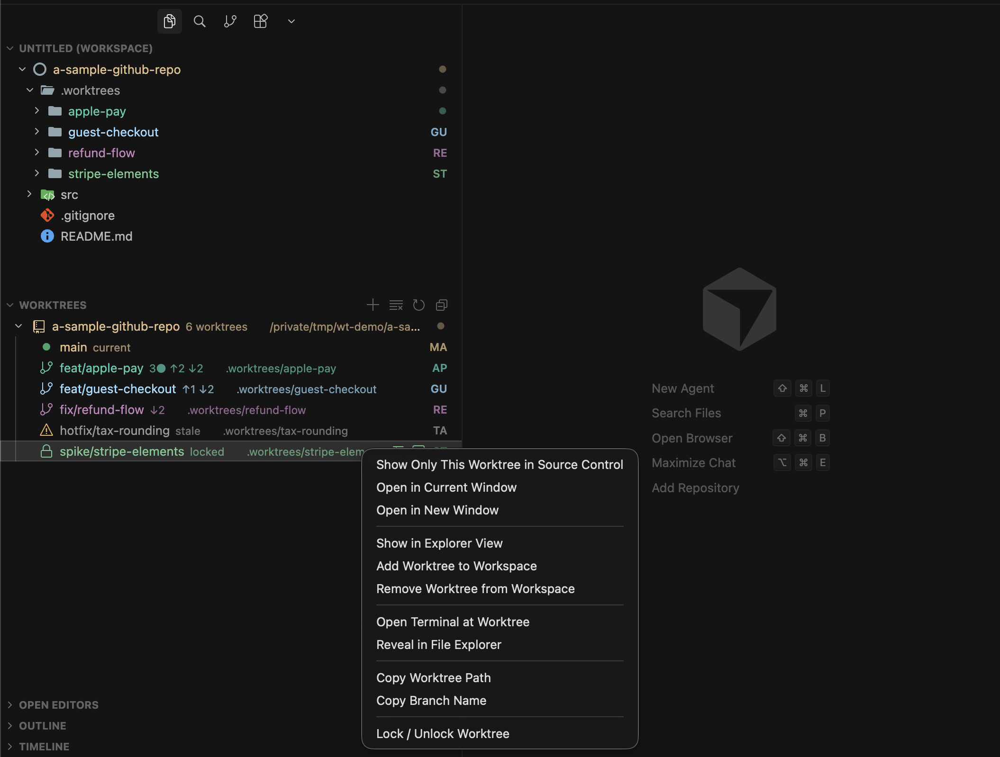

<h1 align="center">Better Worktrees</h1>

<p align="center">
  Every git worktree in your Explorer sidebar, colour-coded by branch type, with uncommitted work, ahead/behind, and the current one visible at a glance.<br>
  Create, check out, fetch, and switch, all without touching a terminal.
</p>

<p align="center">
  <a href="#installation"></a>
  
  
</p>

https://github.com/user-attachments/assets/ffd4ad7e-a03e-4e0d-adfa-8736c7335916

Worktrees let you keep several branches checked out at once, but the editor leaves you guessing which one has unsaved work and which the current window is on. Better Worktrees puts them all in one place and keeps every action one click away.



> ### 🎨 Colour-coded by branch type
>
> Every worktree is tinted by what kind of branch it is: 🔵 **feature**, 🔴 **fix**, 🟣 **release**, 🟢 **chore**, ⚪ **`main`**, 🟠 **untyped**, so you read the list by kind instead of squinting at names. The type is detected anywhere in the branch, so `user/login-crash-fix` still reads as a fix. [Fully themeable.](#colouring-worktrees)

And each row carries its state inline:

| Badge | Meaning |
|---|---|
| `● main` | the worktree the current window has open |
| `3●` | uncommitted changes |
| `↑2` / `↓2` | commits ahead of / behind upstream |
| `🔒 locked` | locked, protected from removal |
| `⚠ stale` | directory is gone, prune to clean up |

Click a row to focus Source Control on it; right-click for the full action menu.

---

## Features


|                         | What it does                                                                                                               |
| ----------------------- | -------------------------------------------------------------------------------------------------------------------------- |
| **Create**              | Walk through a branch name, start point, and destination, suggested from a template and editable before anything is written. |
| **Check out existing**  | Pick a local or remote-tracking branch (skipping ones already in a worktree) and get a worktree on it.                     |
| **From a pull request** | `gh pr checkout` into a fresh worktree, cross-fork PRs included.                                                           |
| **Fetch / Pull**        | Per-worktree `fetch --all --prune` and fast-forward-only `pull`, reflected in its status.                                  |
| **Filter & sort**       | Filter the view by branch or path; sort worktrees with uncommitted changes first.                                          |
| **Focus**               | Click a worktree to narrow Source Control to just that branch; restore all in one click.                                   |
| **Open**                | New or current window, workspace root, file manager, or a terminal, plus copy path/branch.                                |
| **Manage safely**       | Lock/unlock with a reason, prune stale entries, and remove (guarded against the main, current, and locked worktrees).      |


Branch names are validated by git, slashes are flattened so `feat/api` stays one folder, and every git call runs through `execFile` (never a shell string).

## Requirements

- `git` available on your `PATH`
- The built-in Git extension (`vscode.git`) enabled
- Optionally, the [GitHub CLI](https://cli.github.com) (`gh`) on your `PATH`, only for *Worktree from Pull Request...*

## Installation

Download the latest `.vsix` from the [Releases page](https://github.com/shivanshthapliyal/vscode-better-worktrees/releases), then install it in either editor.

**From the command line:**

```bash
code   --install-extension better-worktrees-<version>.vsix   # VS Code
cursor --install-extension better-worktrees-<version>.vsix   # Cursor
```

**From the editor UI:** open the Extensions view, click the **⋯** menu → **Install from VSIX…**, and pick the file. Reload the window if prompted.

The same `.vsix` works in both: Cursor is built on VS Code, so nothing editor-specific is required.

## Usage

The **Worktrees** view appears in the Explorer sidebar and groups worktrees by repository. From there you can:

- click **New Worktree…** in the view title to create one, or open the title menu for **Checkout Branch as Worktree…** and **Worktree from Pull Request…**
- click the **search** icon in the view title to filter by branch or path; it becomes a clear-filter button while a filter is active
- click a worktree row to focus the Source Control view on it
- right-click a worktree for the full set of fetch, pull, open, workspace, copy, lock, and remove actions

All commands are also available from the Command Palette under the **Worktrees:** category.

## Settings


| Setting                                | Default                                | Description                                                                                                                                                                                       |
| -------------------------------------- | -------------------------------------- | ------------------------------------------------------------------------------------------------------------------------------------------------------------------------------------------------- |
| `betterWorktrees.showNotifications`    | `true`                                 | Show success notifications. Warnings and errors are always shown.                                                                                                                                 |
| `betterWorktrees.openWorktreeIn`       | `newWindow`                            | Where the open actions put a worktree: `newWindow` or `currentWindow`.                                                                                                                           |
| `betterWorktrees.scanDepth`            | `3`                                    | How many directory levels deep to search each workspace folder for git repositories. `0` scans only the folder root. `node_modules`, `dist`, `.venv`, and similar directories are always skipped. |
| `betterWorktrees.worktreePathTemplate` | `${repoPath}/../${repoName}-${branch}` | Where new worktrees are suggested (see below).                                                                                                                                                    |
| `betterWorktrees.colorMode`            | `branch`                               | How worktree folders are coloured: `branch` (a distinct hashed colour per branch) or `branchType` (a colour per branch kind; see below).                                                         |
| `betterWorktrees.branchTypeMap`        | `{}`                                   | Overrides for the branch-prefix → type mapping used in `branchType` mode. Merged over the built-in defaults.                                                                                      |
| `betterWorktrees.sortDirtyFirst`       | `false`                                | Sort worktrees with uncommitted changes ahead of clean ones. Toggle from the view title.                                                                                                          |


### Colouring worktrees

Worktree folders are tinted in the Explorer so you can tell at a glance which one a file belongs to. Two modes:

- **`branch`** (default): each branch gets its own stable colour, hashed from the branch name across a 20-colour palette (`betterWorktrees.worktreeColor1` to `20`). Different branches are easy to tell apart; the colour carries no meaning.
- **`branchType`**: colour by the branch's *kind*, so every feature branch is one colour, every fix another. A branch is split on `/`, `-`, `_`, and `.`, and **every** token is matched (case-insensitively) through `branchTypeMap`. This means the type keyword is found even when the branch is prefixed by an author or workflow, so `user/login-crash-fix` reads as **fix** and `bot/release-1.2` as **release**. When more than one type matches, precedence is `fix` > `release` > `feature` > `chore` > `main`. Six types, each with its own themeable colour:

  | Type      | Colour                                         | Default keywords                                                            |
  | --------- | ---------------------------------------------- | --------------------------------------------------------------------------- |
  | `main`    | slate (`betterWorktrees.worktreeTypeMain`)     | `main`, `master`, `develop`, `trunk`                                        |
  | `feature` | blue (`betterWorktrees.worktreeTypeFeature`)   | `feat`, `feature`                                                           |
  | `fix`     | red (`betterWorktrees.worktreeTypeFix`)        | `fix`, `bugfix`, `hotfix`, `bug`, `patch`                                   |
  | `release` | purple (`betterWorktrees.worktreeTypeRelease`) | `release`, `rel`, `rc`                                                      |
  | `chore`   | green (`betterWorktrees.worktreeTypeChore`)    | `chore`, `refactor`, `docs`, `test`, `ci`, `build`, `deps`, `style`, `perf` |
  | `other`   | a shade of orange                              | *(nothing matched)*                                                         |

  Unrecognised branches don't all get the same colour: they hash across eight shades of orange (`betterWorktrees.worktreeTypeOther1` to `8`), so they read as one "untyped" family while staying distinguishable from each other.

Add or remap prefixes without touching the defaults. For example, to treat `wip/` as a chore and `epic/` as a feature:

```json
"betterWorktrees.colorMode": "branchType",
"betterWorktrees.branchTypeMap": { "wip": "chore", "epic": "feature" }
```

Every colour above (both palettes) is themeable through `workbench.colorCustomizations`.

### Where new worktrees go

`worktreePathTemplate` accepts three placeholders:


| Placeholder   | Expands to                                                                       |
| ------------- | -------------------------------------------------------------------------------- |
| `${repoPath}` | Absolute path of the repository                                                  |
| `${repoName}` | The repository's directory name                                                  |
| `${branch}`   | The new branch, with slashes flattened to hyphens so it stays a single directory |


A leading `~` expands to your home directory, and a relative template resolves against the repository. The default places each worktree beside its repo. To collect them all under one directory instead:

```json
"betterWorktrees.worktreePathTemplate": "~/.worktrees/${repoName}/${branch}"
```

The suggestion is always shown and editable before anything is created; the template only sets the starting point.

## Development

Building from source, the test/lint/package commands, and the project layout are in [DEVELOPMENT.md](DEVELOPMENT.md).

## License

[MIT](LICENSE) © Shivansh Thapliyal
